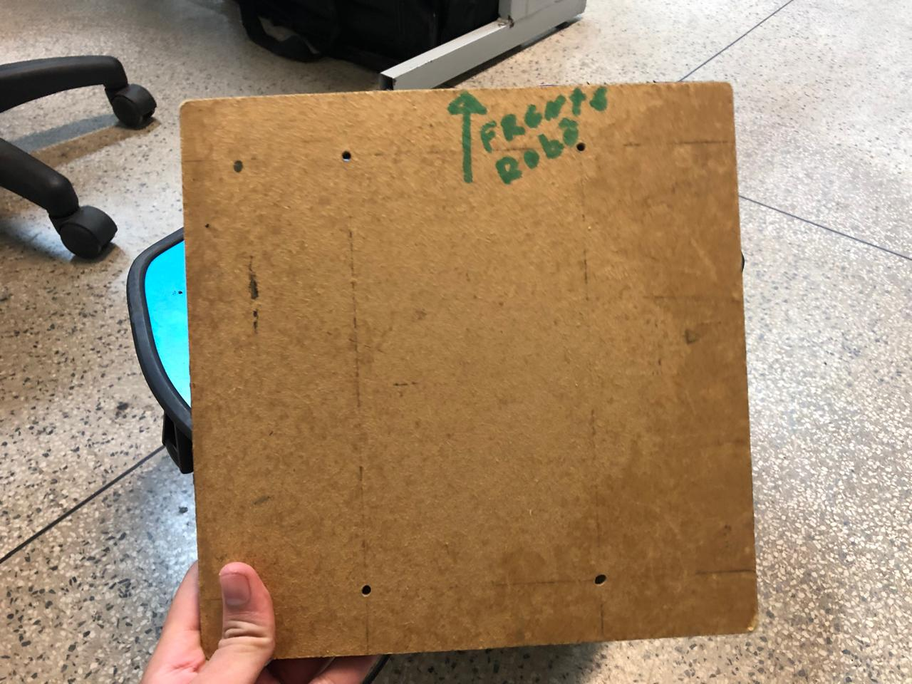

# Guia de Execução: Click-to-Move para o RobIS

### **Visão Geral**

Este documento detalha o processo para executar a aplicação **click-to-move** nos robôs **RobIS**. O sistema é baseado em uma placa **Jetson Nano** e a interação é feita via **SSH**. Durante a demonstração, dois robôs (D2 e D2X) serão utilizados em alternância. Você usará múltiplos terminais pelo menos 6.


# Para facilitar o acesso durante a apresentação, todo o material será executado diretamente no computador do lado da TV. Além disso, foi criado um usuário específico no laboratório com as seguintes credenciais (USAR ESSE USUÁRIO):

* **Usuário:** `brasilia`
* **Senha:** `brasilia`

---

### **Passo 1: Conectar ao Robô via SSH**

Escolha o robô que será utilizado e conecte-se a ele a partir do seu terminal.

# Verifique a tensão da bateria do robô. A faixa de operação ideal é entre 38V e 42V. Se a tensão estiver abaixo de 38V, conecte o robô ao carregador e carregue.
#### **RobIS D2**
* **IP:** `10.10.1.189`
* **Login:** `jetson`
* **Senha:** `jetson`
* **Comando:**
    ```bash
    ssh jetson@10.10.1.189
    ```

#### **RobIS D2X**
* **IP:** `10.10.1.220`
* **Login:** `jetson`
* **Senha:** `jetson`
* **Comando:**
    ```bash
    ssh jetson@10.10.1.220
    ```

---

### **Passo 2: Inicializar o Software Base do Robô (Executar na Jetson) em um terminal**

Após conectar-se ao robô via SSH, você precisa iniciar os componentes essenciais: o container Docker do robô, o driver do LiDAR e o Odrive.
#### **Terminal 1:
1.  **Subir o container do robô:**
    * *Repositório de referência: [is-robis-ros2 (branch: devel)](https://github.com/labvisio/is-robis-ros2/tree/devel)*
    ```bash
    sudo docker run --rm --privileged -it --network=host -v "$(pwd):/workspace/src" -v /dev/bus/usb:/dev/bus/usb --name=robis_ro2 matheusdutra0207/is-robis-ros2:0.0.4 bash
    ```

2.  **Dentro do container, iniciar o node do Odrive:**
    ```bash
    # Ativar o ambiente ROS2
    source install/setup.bash

    # Lançar o nó do Odrive com publicação da odometria
    ros2 launch odrive_ros2_pkg is_robis_ros2_launch.py publish_odom_tf:=true
    ```

> Para confirmar que o comando foi executado com sucesso, observe o **LiDAR do robô**: ele deve começar a girar.  
> Esse movimento indica que o sistema foi inicializado corretamente. 
<p align="center">
    
</p>

### **Passo 3: Executar o Navigation2 (Na sua Máquina Local)**

Esta etapa é executada na sua própria máquina (não no robô) e requer três terminais separados para gerenciar os diferentes componentes do sistema de navegação.

#### **Terminal 2: Container com RViz e Nav2**

1.  **Clone o repositório (se ainda não o tiver):**
    ```bash
    git clone https://github.com/labvisio/navigation2.git # PARA APRESENTAÇÃO EM BRASILIA NÃO VAI PRECISAR EXECUTAR ESSE COMANDO
    cd navigation2
    ```
2.  **Verifique o usuário:** No arquivo `nav2-rviz2-container.sh`, garanta que a variável `USER` está configurada com o nome de usuário da sua máquina. (PARA APRESENTAÇÃO EM BRASILIA O `USER` JÁ FOI ALTERADO)
3.  **Permita a conexão gráfica:**
    ```bash
    xhost +
    ```
4.  **Suba o container de utilitários:**
    ```bash
    sudo ./nav2-rviz2-container.sh
    ```
5.  **Dentro do container, inicie a localização:**
    ```bash
    # Ativar o ambiente ROS2
    source /opt/ros/humble/setup.bash

    # Lançar a localização com o mapa do laboratório
    cd /opt/ros/humble/share/nav2_bringup/maps/
    ros2 launch nav2_bringup localization_launch.py map:=mapa_labsea.yaml
    ```

#### **Terminal 3: Re-inicialização e RViz**

1.  **Acesse o container `ros-utilities` em execução:**
    ```bash
    sudo docker exec -it ros-utilities bash
    ```
2.  **Dentro do container, ative o ambiente ROS:**
    ```bash
    source /opt/ros/humble/setup.bash
    ```
3.  **Re-inicialize a localização global:**
    ```bash
    ros2 service call /reinitialize_global_localization std_srvs/srv/Empty
    ```
4.  **Abra o RViz2 para visualização:**
    ```bash
    rviz2
    ```

#### **Terminal 4: Iniciar Navegação**

1.  **Acesse o container `ros-utilities` novamente:**
    ```bash
    sudo docker exec -it ros-utilities bash
    ```
2.  **Dentro do container, ative o ambiente ROS:**
    ```bash
    source /opt/ros/humble/setup.bash
    ```
3.  **Inicie o Navigation2:**
    ```bash
    ros2 launch nav2_bringup navigation_launch.py
    ```

---

### **Passo 4: Inicializar o Gateway IS-ROS2 (Na sua Máquina Local)**

Em um novo terminal na sua máquina, inicie o gateway que faz a ponte de comunicação.
#### **Terminal 5:**
1.  **Subir o container do gateway:**
    ```bash
    sudo docker run --rm -it --network=host matheusdutra0207/is-ros2-gateway:0.0.1 bash
    ```
2.  **Dentro do container, ative o ambiente:**
    ```bash
    source install/setup.bash
    ```
3.  **Execute o gateway, ajustando o IP para o da sua rede (o comando ja ta na rede do labsea):**
    ```bash
    ros2 run is_ros2_gateway is_ros2_gateway --uri amqp://10.10.2.211:30000
    ```

---

### **Passo 5: Ativar o Node Dynamic Follower (Máquina Específica)**

Este passo **deve ser executado na máquina `10.10.2.92`**.
#### **Terminal 6:**
1.  **Conecte-se à máquina via SSH:**
    * **Usuário:** `ros`
    * **Senha:** `ros123456`
    ```bash
    ssh ros@10.10.2.92
    ```
2.  **Dentro da máquina, execute os seguintes comandos:**
    ```bash
    # Ativar o ambiente ROS Foxy
    source /opt/ros/foxy/setup.bash

    # Navegar até o workspace, compilar e ativar
    cd ~/brasilia/ros2_ws
    colcon build
    source install/setup.bash

    # Executar o nó do seguidor dinâmico
    ros2 run dynamic_follower follower_node
    ```

---

### **Passo 6: Rodar o Cliente Click-to-Move (Máquina de Brasília)**

Este é o passo final, onde você executa a interface que captura os cliques para mover o robô.
#### **Terminal 7:**
1.  **Navegue até o diretório do projeto:**
    ```bash
    cd click-to-move
    ```
2.  **Instale as dependências (se for a primeira vez):**
    ```bash
    pip install -r requirements.txt
    ```
3.  **Execute o cliente, indicando os IDs das câmeras desejadas:**
    ```bash
    cd src
    python3 client.py -c 1 2 3 4
    ```

---

# INFORMAÇÕES BÁSICAS


> Observação: os dois robôs são parecidos, então este procedimento serve para ambos.


## Como ligar o robô

### Passo a passo 
1. Localize um **botão azul**: este é o botão de energização.  
2. Pressione o botão azul para ligar o robô.  
<p align="center">
    
</p>

## Como ligar a jetson

### Passo a passo
1. Localize o **módulo wifi** no painel do robô.  
2. Abaixo dele, há um **botão cinza**: este é o botão para ligar a jetson.  
3. Pressione o botão cinza para ligar a jetson.  

> Observação: após pressionar o botão, a Jetson (localizada dentro do robô) acenderá um **led verde**. 

> Aguarde alguns instantes até que o sistema conclua o boot antes de realizar o acesso via **SSH**.
<p align="center">
    
</p>

## Como colocar o robô para carregar

> Observação: para o robô funcionar corretamente, ele precisa estar **bem carregado**.  
> Caso contrário, pode apresentar mau funcionamento — por exemplo, perder-se durante a navegação ou inverter os eixos **X/Y** da odometria.  
> Portanto, é fundamental manter os robôs sempre carregados.

### Passo a passo
1. Localize o **botão azul** de energização do robô.  
2. À esquerda do botão azul, há uma **entrada com 3 pinos**: esta é a entrada do carregador.  
3. Conecte o carregador nessa entrada.  

> Observação: na fonte do carregador, um **LED vermelho** indica que o robô está carregando (**o robô precisa estar ligado**).  
> Quando a carga estiver completa, o LED mudará para **verde**.  
> Recomendo deixar o robô conectado por mais algum tempo mesmo após o LED ficar verde.  
<p align="center">
    
    
</p>

## ArUco

Para que as câmeras do laboratório consigam localizar o robô, é necessário colocar o **marcador ArUco** em cima dele, na posição correta.  

O robô utiliza o **ArUco de ID 5**.  
Na parte de trás do marcador, há uma indicação de qual lado é a frente: esse lado deve estar voltado para a **frente do robô**.  

### Identificação do marcador
<p align="center">
  
  
</p>


### Exemplo de posicionamento no robô
<p align="center">
    
</p>


### **Repositórios de Referência**

* **Kit Demonstração Visão:** [https://github.com/labvisio/kits-demonstracao-visao/tree/main](https://github.com/labvisio/kits-demonstracao-visao/tree/main)
* **Navigation2:** [https://github.com/labvisio/navigation2/tree/main](https://github.com/labvisio/navigation2/tree/main)
* **Gateway IS-ROS2:** [https://github.com/labvisio/is-ros2-gateway/tree/main](https://github.com/labvisio/is-ros2-gateway/tree/main)
* **RobIS ROS2:** [https://github.com/labvisio/is-robis-ros2/tree/devel](https://github.com/labvisio/is-robis-ros2/tree/devel)
* **Dynamic Follower:** [https://github.com/AntonioSTO/dynamic_follower](https://github.com/AntonioSTO/dynamic_follower)
